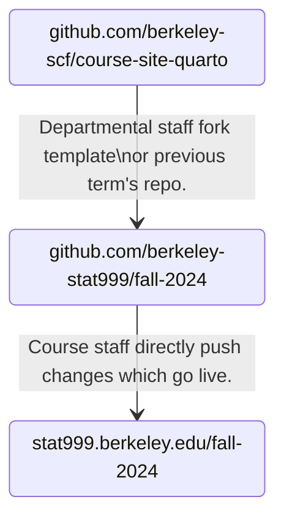
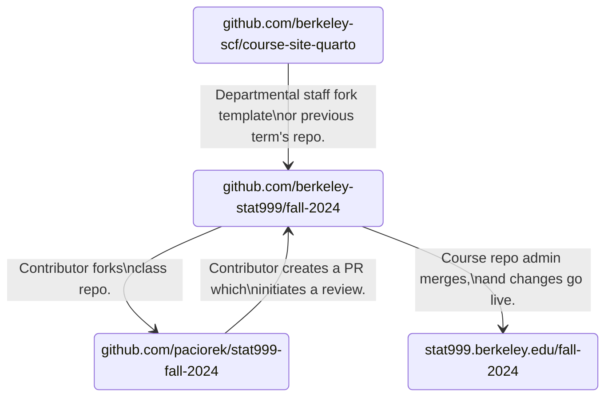

# course-site-quarto

This repository contains a Quarto-based template for class website. You can see a preview of it at [https://berkeley-scf.github.io/course-site-quarto](https://berkeley-scf.github.io/course-site-quarto). This template is intended to be forked and altered for other courses.

For instructors: please see [these instructions](https://github.com/berkeley-scf/course-site-quarto#instructions-for-course-staff) on how to use this repository.


## Capabilities of this Quarto-based Template

- Create a website by modifying content in a GitHub repository.
- Create documents either using Quarto Markdown (qmd), Jupyter notebook (ipynb), or Markdown files:
- Include LaTeX (including LaTeX macros) for mathematical notation.
- Include code chunks that are dynamically evaluated and whose output is included in the document (qmd or ipynb files only).
- Include external webpages (such as Google calendars) as iframes within a page.
- Have documents be rendered to HTML or PDF (the latter for documents that students will download).
- Render a schedule from a YAML plain text file of information.
- Have the website be searchable.
- Quarto features include:
   - Various nice features such as callouts, tabsets, code folding, etc.
   - The ability to embed raw HTML for full flexibility when your output is HTML (but not PDF), including styling using CSS.
   - The ability to dynamically populate HTML elements with data from plain text data files (in yml format).

## Terminology

- "Rendering" a document or a site involves converting the *source* Markdown/notebook file to html, running any code chunks and including output. 
- "Previewing" a site involves rendering the site and displaying locally (i.e., at `localhost:<port>` in a web browser.
- "Publishing" a site involves pushing the rendered site to the `gh-pages` branch of the GitHub repository so it can be viewed at the public URL.

## Workflow Overview

### Centralized Workflow

The simplest workflow is where departmental staff fork this template or a previous semester's repo into a new one. The instructor (and course staff of their choosing) are given permission to make changes.

For example, given the class repo https://github.com/berkeley-stat999/fall-2024 :


### Fork and Pull Request Workflow

Another method involves course staff forking the class repo into their own GitHub account. They would then make pull requests in the class repo, and following feedback, discussion, alterations, etc., authorized staff could merge the PRs. This gives the instructor or repo admin a bit more control over changes.

For example, given the instructor with GitHub handle `@paciorek` and the shared class repo https://github.com/berkeley-stat999/fall-2024 :




## Instructions for Course Staff


These instructions have been tested under MacOS.

1. Install [Quarto](https://quarto.org/docs/get-started) for Mac, Windows, or Linux.

2. [Install Git](https://git-scm.com/downloads) if you don't have it installed.

3. When department staff notify you that the class repository is ready, clone it into a local working directory on your computer. For the purposes of these instructions, we'll pretend your repository is at https://github.com/berkeley-stat999/fall-2024.
   - You can do this from the terminal/commandline or within a Git graphical application (e.g., `GitHub Desktop`).
   - From the terminal it would look like this:
     ```bash
     git clone https://github.com/berkeley-stat999/fall-2024
     cd fall-2024
     ```
   If you need to maintain several of these websites and there is a conflict in working directory names, you can just rename the working directory after cloning it, e.g. `mv fall-2024 stat999-fall-2024; cd stat999-fall-2024`.


4. Begin making changes relevant to your course.
   - In `_quarto.yml`, modify the site's metadata and table of contents to reflect the structure you want.
   - In `index.qmd`, change "999" to the actual course number in the `title` and set the description. Also change the term in the `subtitle`.
   - In `syllabus.qmd`, change "999" to the actual course number in the table of contents and headings.

   - Update `README.md` as needed.
   - Edit the other Markdown (or Quarto Markdown) files in the working directory and add files as desired. You can make use of various Quarto features discussed in the [Quarto docs](https://quarto.org/docs/authoring).
   - Update `schedule.yml` and `buttons.yml` to reflect the material you want displayed in the main page, or move or remove the `#schedule` or `#buttons` items as desired, as well as the accompanying `listing` items in the yaml header of the document.
   - Check the license assigned to the materials posted on the site (by default CC-BY) in `license.qmd` to make sure you are comfortable with it. You're welcome to choose another license that you prefer. If you'd like to not allow commercial use, you might choose CC-BY-NC. You might also consider not allowing derivative works, for example by choosing [CC-BY-ND](https://creativecommons.org/licenses/by-nd/4.0/deed.en) or CC-BY-NC-ND, as chosen for Data 8, but note that this license can make it hard for others to use the material in part or to build upon it. 

5. Update your repository with the changes to your source files. First tell git about all files that should be in your repo.

   ```bash
   git add NEWFILE1.md NEWFILE2.md NEWDIRECTORY
   ```

   Then commit your changes:
   ```bash
   git commit -m "Initial checkin for Stat 999."
   ```

   If you modify an existing file, you can either do `git add currentfile.md` or include the `-a` flag when you run `git commit` to automatically update files that Git is already keeping track of, e.g., after modifying unit 7 files, `git commit -am "Updated Unit 7"`.

6. Push your changed to GitHub (you might choose to wait to do this until after previewing the site, discussed in the next section).

   ```bash
   git push
   ```

### Preview Changes (Optional)

If you want to preview the website locally on your own computer before they go live, follow these instructions. It is not strictly necessary, but we recommend doing so to spot errors. If you are confident that your changes will not break anything (for example for quick fixes), you can skip this section.

Run `quarto preview` to see your site locally. Quarto will bring up the website in a browser tab pointed to a localhost URL, such as `http://localhost:3456`. 

   - You can leave the preview running as you make changes to the source files; saving changes to the source files will generally (with a few exceptions, such as .ejs files) will be reflected live in your browser.

   - You can also run `quarto render` to create the HTML (in the `_site` directory) without automatically displaying it. Or `quarto render file.qmd` to just render a single file. 
      - Note that you shouldn't commit the files in `_site` to your repository as they will be frequently regenerated and having them in the repository can complicate matters.

### Publish Your Changes

This section is relevant if you will be publishing the site from within your local development environment. It is also possible for SCF staff to set up automated publishing through actions such as a button push on GitHub, a schedule, or following `git` commands like pushes or commits. Contact SCF staff for details.

1. Run `quarto publish gh-pages` from the command line to push updates to the course website.
   - Hit `Y` when prompted to "Update site at `https://stat999.stat.berkeley.edu/fall-2024/? "`
   - Wait a minute for the content to be rendered on your computer. You should then see a message that files are being updated in the `gh-pages` branch.
   - Wait a minute for the content to be copied to the GitHub Pages site.

2. You can observe the build process at GitHub by clicking on the Actions button at the top of your repository, e.g. https://github.com/berkeley-stat999/fall-2024/actions. It usually takes a couple of minutes for this to complete. 

3. If there are no problems, your website will be publicly available at https://stat999.berkeley.edu/fall-2024 (as well as at `https://berkeley-stat999.github.io/fall-2024`).

4. As you make changes, you can continue to run `quarto publish gh-pages`. The publishing process saves the rendered files for the webpage to the `gh-pages` branch of your repository. You will also want to regularly save (i.e., commit any changes to) the source files in the `main` (default) branch of your repository (Steps 5 and 6 above).

The SCF is happy to help. Please [contact us](https://statistics.berkeley.edu/computing/how-get-help) if you are a Berkeley Statistics instructor and you run into problems or questions.

## Instructions for Department Staff

1. Create a GitHub organization for the course if one does not already exist. It should be named `berkeley-statNNN` where `NNN` is the course number.

1. If it was necessary to create a new GitHub organization, create a course overview repository and website as well.

   a. Instantiate the template at https://github.com/berkeley-scf/course-overview into the new organization.

   a. Complete the course overview section and make other course-specific adjustments.

   a. Add the CNAME to https://github.com/berkeley-statNNN/course-overview/settings/pages > Custom domain. This will add a `CNAME` file to the repository.

1. Request an offsite hostname and top-level CNAME for statNNN.berkeley.edu:

   a. Log into socreg.berkeley.edu and go to Security Contacts > Statistics
   a. Go to the Offsite Hostnames tab.
   a. Click "New Offsite Hostname" and create a new entry for each course:
      1. Offsite Hostname: statNNN.berkeley.edu
      1. Alternative Hostnames:
      1. Description: Host instructional materials for the course.
      1. The Hosting Service: GitHub Pages
      1. Okay to Scan: Yes
      1. PI: P1
      1. Hosting Service IP: berkeley-statNNN.github.io
      1. Canonical Hostname: berkeley-statNNN.github.io
      1. Notes to DNS Administrator: This is analogous to the DNS entries for our other classes.
   a. This generates a ticket. Once approved for offsite hosting, their ServiceNow process creates a follow up ticket with the campus hostmaster.
   a. Wait for the campus hostmaster to create the CNAMEs.

   The offsite entry is usually approved quickly, and the CNAME might take a week or two.

1. Fork this `course-site-quarto` repository template:

   a. Visit https://github.com/berkeley-scf/course-site-quarto.

   b. Above the file list click **Use this template** and then **Create a new repository**. This will then bring you to a screen where you'll configure the new repository.

   c. Do not enable the **Include all branches** checkbox.

   d. Place the repository into the per-course organization, e.g. `berkeley-statNNN` and name it after the academic term in lowercase, e.g. `fall-2024`.

   e. You might choose the default of having your repository be public or choose that it be private while you are setting things up. Or you might choose for it always to be private.

   f. Click on **Create Repository**.

1. Clone the new repository into a local working directory. Consider making the following changes:

   a. Replace this README with the content shown in the next section.

   b. In `_quarto.yml`, either modify the link at `website.tools.href` to point to the class's GitHub repository, rather than the template repository, or remove the GitHub link altogether. If present, it will show up under the website logo and above the search bar in the upper left of the site. Also change "999" to the actual course number in `website.title`.

1. Create an empty `gh-pages` branch by following [upstream instructions](https://quarto.org/docs/publishing/github-pages.html#source-branch):

   ```bash
   git checkout --orphan gh-pages
   git reset --hard # make sure all changes are committed before running this!
   git commit --allow-empty -m "Initialising gh-pages branch"
   git push origin gh-pages
   git checkout main
   ```

1. Enable GitHub Pages in the repository. Go to Settings > Pages > Source > Deploy from a branch, and set the branch to be `gh-pages`.

### Example README Content for Actual Class Repositories

This is the repository for the course website and course material for Statistics XYZ for Fall 2024. 
The website for which this content is the source materials is available at <https://statXYZ.berkeley.edu/fall-2024>.


